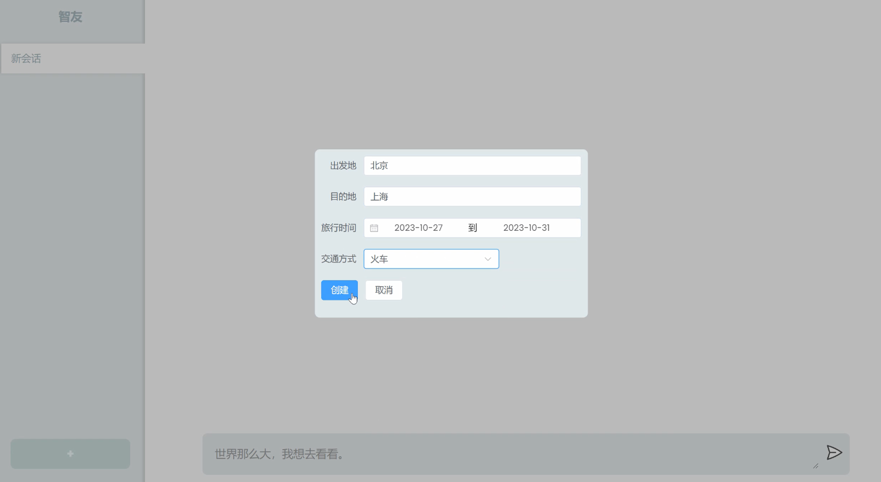
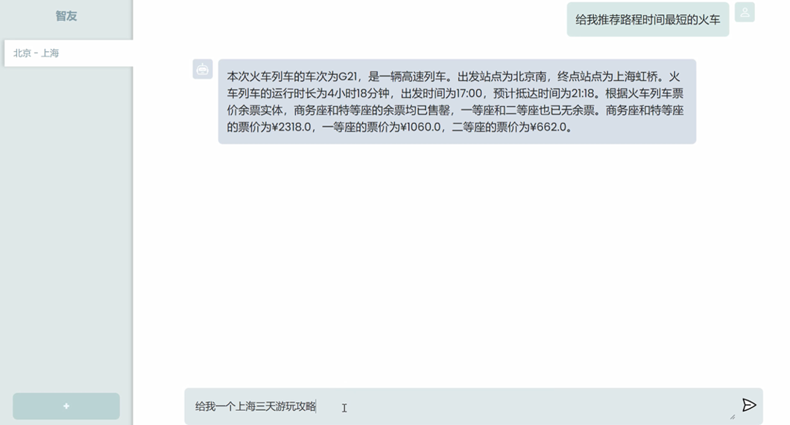

# chatpage

A simple front-end chat webpage.

## Feature

- Written using Vue 3 and the composite API
- using separate store.js file to save all the public variables.(Not standardized, but simple)

## Preview



## Project Setup

```
yarn
```

## Compile and Hot-Reload for Development

```
yarn dev
```
